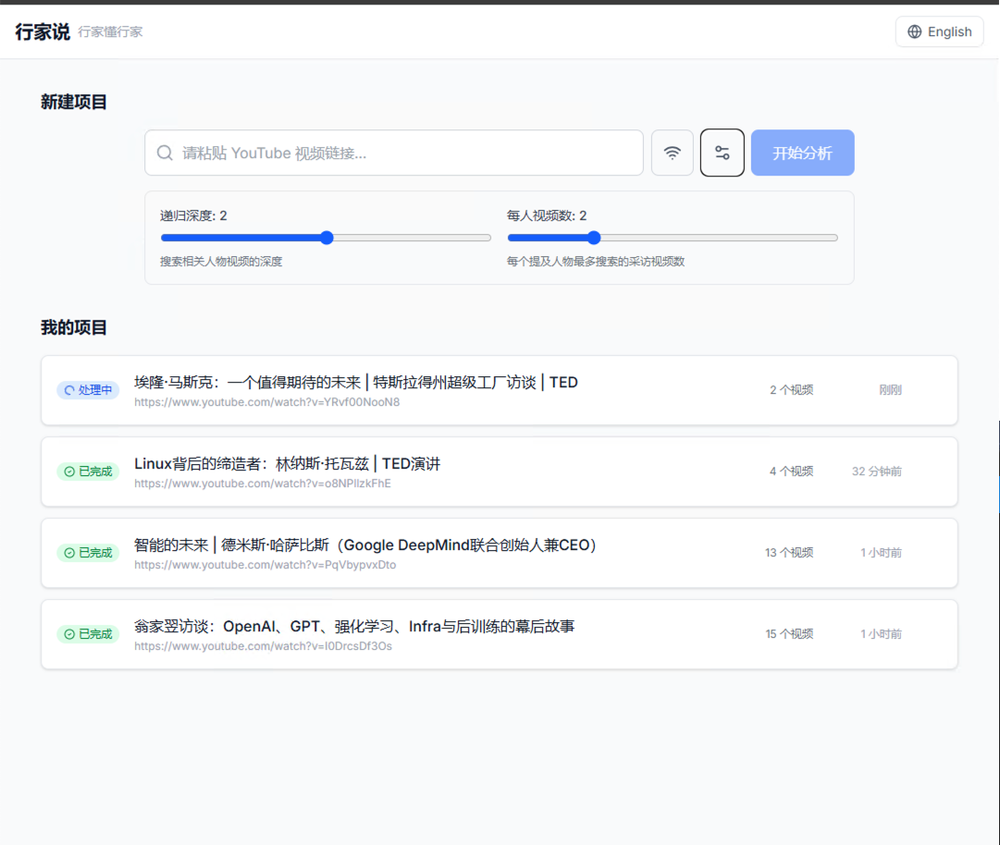
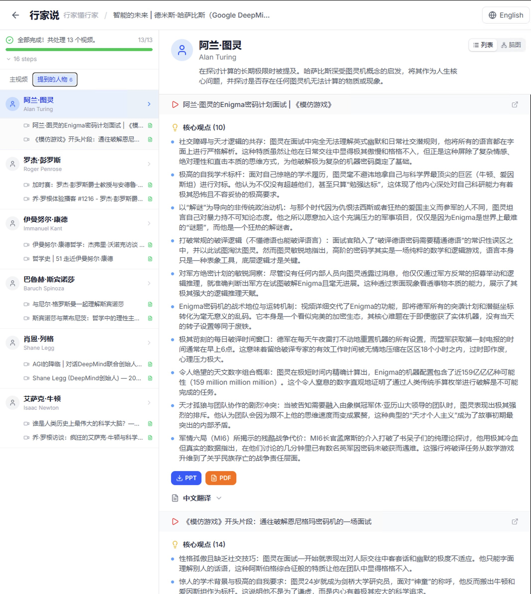
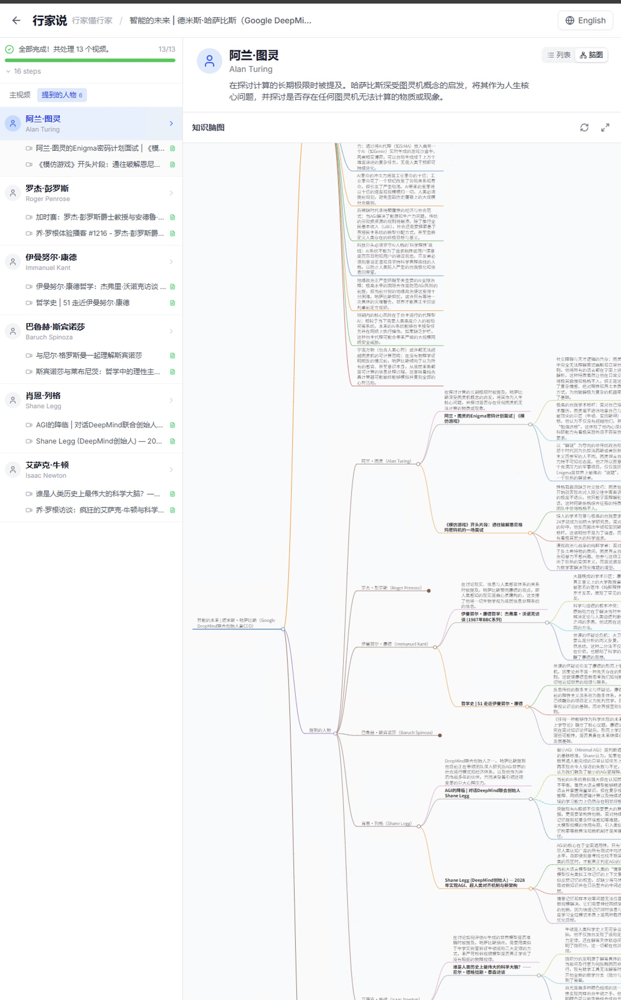

# ExpertTalk (行家说)

> **Chinese**: 行家说 — 行家懂行家
> **English**: ExpertTalk — Like minds

An intelligent YouTube video analysis system. Input a YouTube URL → transcribe & translate to Chinese → extract key insights → generate high-quality PPT → automatically discover mentioned people → search their interview videos → recursively process. Supports CN/EN language switching.

## Screenshots

### Home — Project List



Create new projects and browse analysis history. Supports CN/EN toggle.

### Workspace — Person Detail



Left sidebar groups content by person with associated video titles; right panel shows person details, key insights, PPT/PDF download.

### Workspace — Knowledge Mindmap



Interactive mindmap visualization with auto-fit height and collapsible nodes.

---

## Tech Stack

| Layer | Technology |
|---|---|
| Frontend | TypeScript + React Router v7 + TailwindCSS v4 |
| Backend | Python 3.12 + uv + FastAPI |
| Video Download | yt-dlp |
| Transcription | Local Whisper large-v3 (CUDA GPU acceleration) |
| AI Analysis | OpenRouter API (OpenAI SDK), default model `google/gemini-3.1-pro-preview` |
| PPT Generation | python-pptx (16:9 widescreen, modern color scheme, image embedding) |
| Video Search | yt-dlp ytsearch (no API key required) |
| Cache | SQLite per-step cache (avoids redundant processing) |
| Project Persistence | SQLite projects.db (project/task metadata + results) |
| Mindmap | markmap-lib + markmap-view (interactive SVG) |
| PDF Conversion | comtypes (PowerPoint COM) / LibreOffice headless |
| i18n | React Context (CN/EN switching) |
| Communication | REST API + WebSocket (real-time progress) |

---

## Project Structure

```
prj6/
├── README.md                         # This file
├── backend/                          # Python backend
│   ├── pyproject.toml                # uv project config
│   ├── .env                          # Environment variables (API keys, etc.)
│   ├── app/
│   │   ├── main.py                   # FastAPI entry + cache initialization
│   │   ├── config.py                 # Config management (Pydantic Settings)
│   │   ├── api/
│   │   │   ├── routes.py             # REST API routes
│   │   │   └── websocket.py          # WebSocket progress push
│   │   ├── agents/
│   │   │   ├── orchestrator.py       # Orchestrator agent (control flow + caching)
│   │   │   ├── video_fetcher.py      # Video download + transcription
│   │   │   ├── content_analyzer.py   # LLM translation + analysis + people detection
│   │   │   ├── ppt_generator.py      # PPT generation (multi-layout + images)
│   │   │   └── person_searcher.py    # Person video search
│   │   ├── models/
│   │   │   └── schemas.py            # Pydantic data models
│   │   └── utils/
│   │       ├── cache.py              # SQLite cache manager
│   │       ├── project_store.py      # SQLite project persistence
│   │       ├── pdf_converter.py      # PPT → PDF conversion
│   │       ├── whisper_client.py     # Whisper wrapper
│   │       └── youtube_client.py     # yt-dlp search wrapper
│   └── output/                       # PPT files + cache.db + projects.db
│
├── frontend/                         # React Router v7 frontend
│   ├── package.json
│   ├── tsconfig.json
│   ├── vite.config.ts
│   ├── app/
│   │   ├── root.tsx                  # Root layout + LocaleProvider
│   │   ├── routes/
│   │   │   ├── home.tsx              # Home — project list + create
│   │   │   └── workspace.tsx         # Workspace — split-pane layout
│   │   ├── components/
│   │   │   ├── app-header.tsx        # Brand header + language toggle
│   │   │   ├── video-input.tsx       # URL input component
│   │   │   ├── video-sidebar.tsx     # Left sidebar panel
│   │   │   ├── video-detail.tsx      # Right video detail panel
│   │   │   ├── person-detail.tsx     # Right person detail panel
│   │   │   ├── video-card.tsx        # Video result card
│   │   │   ├── mindmap-view.tsx      # Interactive mindmap
│   │   │   └── processing-pipeline.tsx # Processing pipeline visualization
│   │   ├── hooks/
│   │   │   └── use-websocket.ts      # WebSocket progress listener
│   │   ├── lib/
│   │   │   ├── api.ts                # API client
│   │   │   └── i18n.tsx              # CN/EN internationalization
│   │   └── types/
│   │       └── index.ts              # TypeScript type definitions
│   └── public/
```

---

## Core Data Flow

```
User inputs URL
    │
    ▼
[FastAPI] Receives request, creates task, returns task_id
    │
    ▼ WebSocket pushes progress
┌─────────────────────────────────────┐
│ Orchestrator (agent + cache check)  │
│                                     │
│  1. VideoFetcher                    │
│     ├─ [cache] fetch:{video_id}     │
│     ├─ yt-dlp download audio        │
│     ├─ Extract YouTube captions     │
│     └─ Whisper local transcription  │
│              │                      │
│  2. ContentAnalyzer                 │
│     ├─ [cache] analyze:{id}:{model} │
│     ├─ LLM: Translate to Chinese    │
│     ├─ LLM: Extract key insights    │
│     ├─ LLM: Generate PPT outline    │
│     └─ LLM: Identify people         │
│              │                      │
│  ┌───────────┴──────────┐          │
│  │                      │          │
│  ▼                      ▼          │
│  3. PPTGenerator    4. PersonSearcher │
│  ├─ [cache]         ├─ [cache]       │
│  ├─ Multi-layout    └─ yt-dlp search │
│  ├─ Image embed          │          │
│  └─ Generate .pptx  Found video URLs │
│                          │          │
│                     Recurse to step 1│
│                     (depth+1)        │
└─────────────────────────────────────┘
    │
    ▼ WebSocket pushes results
[React Router v7 frontend] Display progress, insights, download PPT
```

---

## Core Module Design

### 1. Data Models (schemas.py)

```python
class PersonInfo(BaseModel):
    name: str
    name_cn: str                    # Chinese name
    context: str                    # Context of mention in video
    related_videos: list[str] = []  # Found related video URLs
    thumbnail_url: str = ""         # Search result thumbnail URL

class SlideContent(BaseModel):
    slide_type: str                 # title, section_title, content, quote, summary,
                                    # two_column, highlight, timeline
    title: str
    bullet_points: list[str] = []
    quote: str = ""
    speaker: str = ""
    notes: str = ""
    image_url: str = ""             # Image URL
    highlight_text: str = ""        # Large text for highlight slides
    left_title: str = ""            # two_column left column title
    right_title: str = ""           # two_column right column title
    left_points: list[str] = []     # two_column left column points
    right_points: list[str] = []    # two_column right column points

class VideoAnalysis(BaseModel):
    video_id: str
    video_url: str
    title: str
    title_cn: str = ""              # Chinese title
    transcript: str = ""            # English transcript (first 500 chars)
    transcript_cn: str = ""         # Chinese translation
    key_points: list[str] = []      # Key insights
    mentioned_people: list[PersonInfo] = []
    slides: list[SlideContent] = []
    ppt_filename: str = ""          # Generated PPT filename
    depth: int = 0                  # Current recursion depth

class PipelineStep(BaseModel):
    key: str                        # Step identifier (e.g. fetch, analyze, ppt)
    label: str                      # Display name
    status: str = "pending"         # pending/in_progress/completed/failed
    detail: str = ""                # Additional info (e.g. "cached, skipped")

class TaskProgress(BaseModel):
    task_id: str
    status: str = "pending"         # pending/processing/completed/failed
    current_step: str = ""          # Current step description
    progress_pct: float = 0         # 0-100
    total_videos: int = 0
    processed_videos: int = 0
    results: list[VideoAnalysis] = []
    error: str = ""
    steps: list[PipelineStep] = []  # Pipeline step list

class TaskCreate(BaseModel):
    video_url: str
    max_depth: int = 2              # Recursion depth
    max_videos_per_person: int = 2  # Max videos searched per person
```

### 2. Orchestrator (orchestrator.py)

- Receives tasks and manages overall flow
- Maintains `processed_urls: set` to avoid duplicates
- Controls recursion depth via `max_depth`
- **Checks SQLite cache before each step** — cache hit skips processing and shows "cached, skipped"
- Pushes progress via WebSocket callback (including step list status)
- Async processing with `asyncio`
- Passes `thumbnail_url` to PPT generator

### 3. VideoFetcher (video_fetcher.py)

- Prioritizes YouTube built-in captions (saves transcription time)
- Falls back to audio download + local Whisper when no captions available
- Whisper model: `large-v3` (highest accuracy, CUDA GPU acceleration)
- Returns `video_id`, `title`, `thumbnail`, `transcript`, `duration`

### 4. ContentAnalyzer (content_analyzer.py)

- Single OpenRouter LLM API call for: translation + insight extraction + people identification + PPT outline
- Uses JSON format requirements for stable response structure
- Segments long videos to avoid token limits (`llm_max_tokens: 32000`)
- Generates **15-25 high-quality** slides, each bullet point 2-3 sentences
- Supports 7 slide types:
  - `section_title` — Section divider
  - `content` — Standard content page
  - `quote` — Quote page (3-5 per deck)
  - `two_column` — Side-by-side comparison
  - `highlight` — Large text emphasis for key data/quotes
  - `timeline` — Timeline layout
  - `summary` — Summary page

### 5. PPTGenerator (ppt_generator.py)

- **16:9 widescreen** (13.333 x 7.5 inches)
- **Modern color scheme**: Dark navy primary + blue accent + warm gold highlight
- Chinese font support (Microsoft YaHei, East Asian fallback via XML)
- **8 slide layouts**:
  - `title` — Cover page (with optional video thumbnail)
  - `section_title` — Section divider (dark background + gold line)
  - `content` — Content page (blue bullet dots + top title bar)
  - `quote` — Quote page (left blue bar + large quote + gold dash)
  - `two_column` — Two-column comparison (center divider + independent titles)
  - `highlight` — Highlight page (blue background + 44pt centered text)
  - `timeline` — Timeline page (left blue line + alternating blue/gold nodes)
  - `summary` — Summary page
- Person introduction pages (letter avatar or real search thumbnail)
- Table of contents + closing page
- Bottom decorative bar + page numbers on every slide

### 6. PersonSearcher (person_searcher.py)

- Uses **yt-dlp ytsearch** to search `"{name} interview"` and `"{name} talk keynote"`
- No API key required
- Filters: duration > 5 minutes, excludes shorts
- Returns top N most relevant videos per person (with thumbnail)

### 7. Cache System (cache.py)

SQLite single-file cache at `output/cache.db`:

| Step | Cache Key | TTL | Description |
|------|-----------|-----|-------------|
| fetch | `fetch:{video_id}` | Permanent | Same video, same transcript |
| analyze | `analyze:{video_id}:{llm_model}` | Permanent | Auto-invalidates on model change |
| ppt | `ppt:{video_id}:{llm_model}` | Permanent | Also checks if file exists |
| search | `search:{person_name}:{max_per_person}` | 7 days | Search results change over time |

On cache hit: step detail shows "cached, skipped" — completes in seconds.

---

## API Design

| Method | Path | Description |
|--------|------|-------------|
| POST | `/api/tasks` | Create analysis task (also creates project) |
| GET | `/api/tasks/{id}` | Get task status and results |
| GET | `/api/tasks/{id}/download/{video_id}` | Download PPT for a video |
| GET | `/api/tasks/{id}/download/{video_id}/pdf` | Download PDF |
| GET | `/api/projects` | Project list (compact, without results) |
| GET | `/api/projects/{id}` | Project details (with full TaskProgress) |
| DELETE | `/api/projects/{id}` | Delete project |
| GET | `/api/test-connectivity` | Test YouTube/Google connectivity |
| WS | `/ws/tasks/{id}` | WebSocket real-time progress |

---

## Frontend UI Design (Bilingual)

### Routes

| Path | Page | Description |
|------|------|-------------|
| `/` | home.tsx | Project list + create new project |
| `/workspace/:taskId` | workspace.tsx | Split-pane workspace |

### Home Page Layout

1. **Top**: Brand header (行家说 / ExpertTalk + language toggle)
2. **Create**: URL input + parameter settings + start analysis → navigate to workspace
3. **Project List**: Card grid showing title / status / time / video count

### Workspace Layout (Split Pane)

1. **Top**: Header + project title + back button
2. **Left** (320px): Progress bar + person groups with video titles
3. **Right** (flex-1): Selected person/video detail (insights / people / translation / PPT download / mindmap)

### Components

- `video-input.tsx`: URL input + parameter sliders + submit
- `video-sidebar.tsx`: Left panel — tabs (Main Video / Mentioned People), person groups with video titles
- `video-detail.tsx`: Right panel — video detail with YouTube link, key points, PPT/PDF download
- `person-detail.tsx`: Right panel — person detail with per-video sections
- `mindmap-view.tsx`: Interactive knowledge mindmap (markmap)
- `processing-pipeline.tsx`: Pipeline step visualization (based on PipelineStep status)
- `video-card.tsx`: Video result card (with collapsible details)

---

## Error Handling

- yt-dlp download failure → Retry 2 times, skip and log if still failing
- Whisper transcription failure → Fallback to YouTube auto-captions
- LLM API timeout/rate-limit → Log error, mark step as failed
- Person search failure → Log error, skip person search
- PPT generation failure → Log error, does not affect other video processing

---

## Required API Key

- `OPENROUTER_API_KEY`: OpenRouter API (for LLM content analysis)

> Note: Video search uses yt-dlp ytsearch — no YouTube API key required.

---

## Verification

1. Input a known YouTube video URL
2. Confirm successful download and transcription
3. Verify Chinese translation and key insight extraction quality
4. Confirm PPT generation with multiple layouts (two-column / highlight / timeline, etc.)
5. Confirm person identification and recursive search work correctly
6. Confirm real-time progress updates in web UI (step list status changes)
7. Re-submit the same video → All steps show "cached, skipped", completes in seconds
8. Change `llm_model` in config → Analysis and PPT caches auto-invalidate, re-execute
